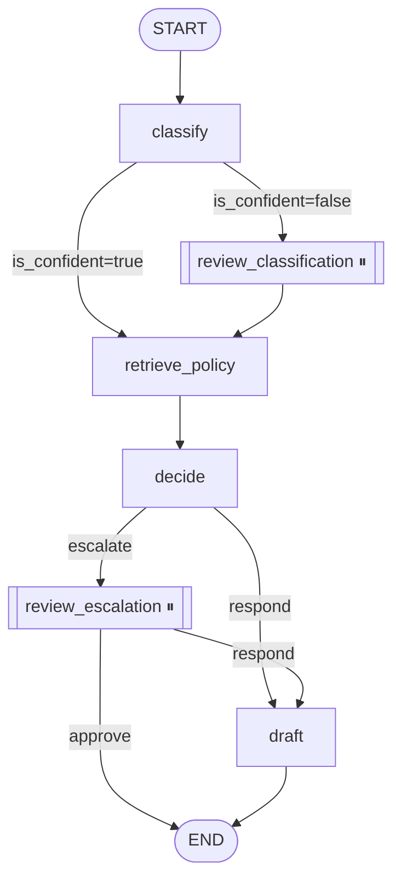

# Triage Workflow (langgraph-agent-workflow)

A **multi-step customer-support triage agent** built with LangGraph, FastAPI, and a local LLM. Given a ticket, it:

1. **Classifies** it (billing / technical / shipping / account / other).
2. **Retrieves** the matching company policy.
3. **Decides** whether to respond automatically or escalate.
4. **Drafts** a reply.
5. **Pauses for human review** whenever the classifier is unsure or the customer explicitly demands escalation.

Everything runs locally — no cloud services, no API keys.

## Why this exists

Real support systems aren't "one LLM call." They're **stateful, multi-step, and require human oversight at specific decision points**. LangGraph is the right tool because it gives you:

* **Explicit state** shared across steps
* **Conditional routing** based on intermediate results
* **Persistence** — a run can be paused, inspected, and resumed
* **Human-in-the-loop** as a first-class primitive (`interrupt()`)

This repo is a small, complete demonstration of all four.

## Architecture



See `docs/architecture.md` for the state schema and regeneration instructions.

## Quick Start

1. **Start the stack:**

   ```bash
   docker-compose up --build
   ```

2. **Pull the model** (one-time, ~400 MB):

   ```bash
   docker-compose exec ollama ollama pull qwen2.5:0.5b
   ```

3. **Verify:**

   * Health check: `http://localhost:8000/health`
   * OpenAPI docs: `http://localhost:8000/docs`

## Service Contract

### `POST /workflow/run`

Start a new run.

**Request:**

```json
{
  "ticket_text": "I was charged twice for my last order. Please refund."
}
```

**Response — normal completion:**

```json
{
  "run_id": "e2f8c3b1-...",
  "status": "completed",
  "state": {
    "category": "billing",
    "is_confident": true,
    "policy_reference": "Billing policy: Refunds are issued within 5 business days...",
    "decision": "respond",
    "draft_response": "I'm sorry for the duplicate charge...",
    "trace": [
      {
        "node": "classify",
        "category": "billing",
        "is_confident": true
      },
      {
        "node": "retrieve_policy",
        "category": "billing"
      },
      {
        "node": "decide",
        "decision": "respond"
      },
      {
        "node": "draft",
        "chars": 138
      }
    ]
  },
  "interrupt": null
}
```

**Response — awaiting human review:**

```json
{
  "run_id": "b4a5...",
  "status": "awaiting_review",
  "state": {
    "category": "other",
    "decision": "escalate",
    "trace": [ ... ]
  },
  "interrupt": {
    "reason": "escalation_requires_approval",
    "ticket_text": "I want to speak to a manager...",
    "instructions": "Reply with {'action': 'approve'} to escalate, or {'action': 'respond'} to attempt an automated reply."
  }
}
```

### `GET /workflow/{run_id}`

Inspect the current state of any run — completed or paused. Returns the same shape as `POST /workflow/run`.

### `POST /workflow/{run_id}/resume`

Resume a paused run with a human decision.

**Request:**

```json
{
  "action": "approve",
  "note": "Approved by operator."
}
```

Valid actions depend on which interrupt fired:

| Interrupt               | Valid actions                        |
| ----------------------- | ------------------------------------ |
| `review_classification` | `confirm`, `override` (+ `category`) |
| `review_escalation`     | `approve`, `respond`                 |

### `GET /health`

Returns:

```json
{
  "status": "ok",
  "llm_reachable": true
}
```

## Evaluation

Run the labeled dataset (18 tickets) through the workflow:

```bash
docker-compose exec api python -m scripts.run_dataset
```

**Result with `qwen2.5:0.5b` on CPU:**

| Metric                                           |    Value |
| ------------------------------------------------ | -------: |
| Answered runs (no human review needed)           | ~16 / 18 |
| Category accuracy (of answered)                  | ~15 / 16 |
| Correctly routed to human review (vague tickets) |    2 / 2 |

The two vague tickets (*"It's broken, please help."*, *"Something isn't right."*) are intentionally included: the workflow should route them to a human rather than guess.

## Running Tests

```bash
docker-compose exec api python -m pytest tests/ -v
```

The suite covers: health, happy path, escalation interrupt, resume (both `approve` and `respond`), state inspection, 404s, and input validation.

Tests are **structural**, not exact-match, so they stay green even if the LLM's wording shifts.

## Feature Checklist

* ✅ Explicit `StateGraph` with typed `TypedDict` state
* ✅ Conditional edges based on classification confidence and decision outcome
* ✅ SQLite checkpointing (`AsyncSqliteSaver`) — runs persist across API restarts
* ✅ Human-in-the-loop via `interrupt()` — paused runs are inspectable and resumable
* ✅ Graph diagram in README + `docs/architecture.md`
* ✅ 18-ticket labeled dataset with automated evaluation
* ✅ Full pytest integration suite
* ✅ One-command local setup (`docker-compose up`)

## Project Structure

```text
langgraph-agent-workflow/
├── app/
│   ├── main.py                    # FastAPI app + lifespan
│   ├── core/
│   │   ├── config.py              # Settings
│   │   └── llm.py                 # Ollama client
│   ├── graph/
│   │   ├── state.py               # TypedDict state
│   │   ├── nodes.py               # All graph nodes
│   │   ├── policies.py            # Policy catalog
│   │   ├── workflow.py            # Graph builder
│   │   └── runtime.py             # Singleton graph + checkpointer
│   ├── routers/
│   │   ├── health.py
│   │   └── workflow.py            # /run, /{id}, /{id}/resume
│   └── schemas/
│       └── workflow.py             # Pydantic request/response
├── tests/
│   ├── conftest.py
│   └── test_workflow.py
├── scripts/
│   └── run_dataset.py              # Eval on labeled dataset
├── data/
│   └── sample_tickets.json         # 18 labeled tickets
├── docs/
│   └── architecture.md             # Mermaid diagram + state schema
├── docker-compose.yml
├── Dockerfile
└── requirements.txt
```

## Design Decisions

* **`qwen2.5:0.5b` as the default model.** It runs on CPU in seconds, which makes the demo portable. The graph is model-agnostic — swapping the model name in `.env` is a one-line change.
* **SQLite checkpointer, not in-memory.** Runs survive API restarts. This is what makes the "pause for human review, resume later" pattern actually work in practice.
* **`TypedDict`, not Pydantic, for state.** LangGraph's native state type. Pydantic is reserved for the API boundary where validation actually matters.
* **Two interrupt points, not one.** Classification review and escalation review are different human decisions with different payloads. Keeping them separate keeps the API honest about what's being asked of the reviewer.
* **`trace` field in state.** A cheap, effective observability layer — the API response carries the full node-by-node story of the run.

## Rebuild, Run Tests, and Run the Dataset

To rebuild the entire stack and run the test suite and evaluation dataset:

```bash
docker-compose down
docker-compose up --build
docker-compose exec ollama ollama pull qwen2.5:0.5b
docker-compose exec api python -m pytest tests/ -v
docker-compose exec api python -m scripts.run_dataset
```

## What I'd Do With More Time

* **Swap in a larger model** (`llama3.2:1b`, `phi3:mini`) for higher classification accuracy — at the cost of slower CPU inference.
* **Replace SQLite with Postgres** for the checkpointer to support concurrent operators.
* **Add an approval queue** — a `GET /workflow/pending` endpoint listing all runs currently awaiting human review.
* **Policy store from DB** — move the `POLICIES` dict into a table so non-engineers can edit policies.
* **Structured output** — use a JSON-mode model for classification to remove the string parsing entirely.
* **Timeout / retry on LLM calls** — currently a slow model blocks the request thread.
